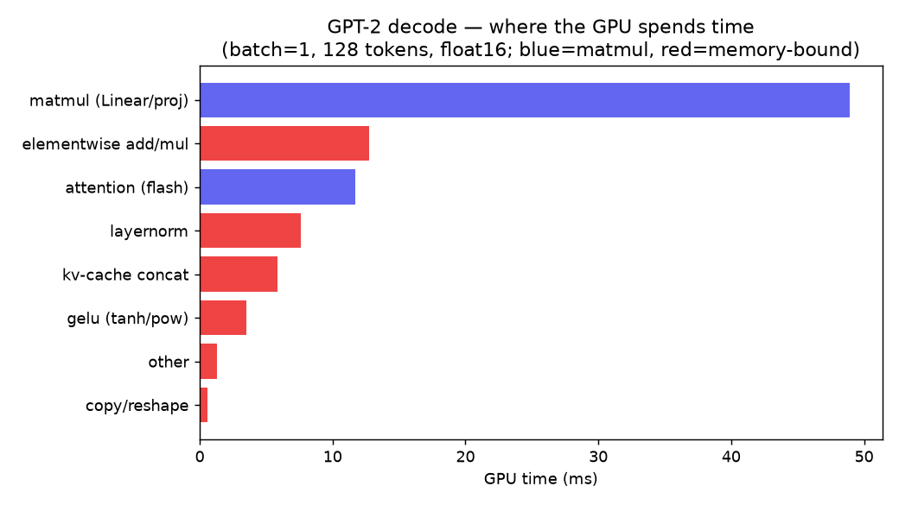

# GPT-2 Inference Optimization

Profiling GPT-2 inference, finding the real bottlenecks, and replacing them with
custom fused [Triton](https://github.com/triton-lang/triton) kernels — each
verified **bit-correct** against PyTorch and measured **end-to-end**, not just in
isolation.

## TL;DR

Decoding GPT-2 small (batch=1, fp16) on a single **RTX 4090**:

| Kernel | Op-level speedup | End-to-end (batch=1) | Shipped? |
|--------|------------------|----------------------|----------|
| **Fused GELU**      | **3.5–7×** vs GPT-2's multi-kernel formula | **+12.5%**  (177.5 → 198 tok/s) | ✅ |
| Fused LayerNorm     | 1.1–1.4× vs `torch.layer_norm`             | −11% (regressed)               | ❌ |

**Result: a verified +12.5% end-to-end speedup** (output bit-identical to stock
GPT-2) from the GELU fusion. The LayerNorm kernel was *correct and faster in a
microbenchmark* but **made the full model slower** — so it was dropped after
ablation. That decision is the most useful part of this repo.


## The story: identify → fix → verify

1. **Identify.** Profiled GPT-2 decode. Two findings overturned the plan:
   - The GPU is **idle ~87%** of the time — only 0.72 ms/token of actual GPU work
     vs 5.63 ms wall-clock. Decode at batch=1 is bound by **per-kernel launch +
     Python overhead** (~237 kernel launches/token), not raw compute.
   - **Softmax is already fused** by PyTorch's flash-attention kernel, so the
     original "fuse softmax first" idea was dropped.
   - Real fusable targets: **LayerNorm** (8%) and **GELU** (4%, and GPT-2 runs it
     as ~6 separate kernels).

   

2. **Fix.** Wrote fused Triton kernels for LayerNorm and GELU; verified each
   bit-correct and microbenchmarked (GELU hits 907 GB/s ≈ 90% of the 4090's
   memory ceiling).

3. **Verify.** Patched them into HuggingFace GPT-2 and measured real tokens/sec,
   with an ablation to see which kernel actually helped:
   - **GELU fusion → +12.5%** (GPT-2's GELU was genuinely unfused).
   - **LayerNorm fusion → −11%** (PyTorch already fuses it; our wrapper overhead
     cost more than it saved).
   - Fusion cut **kernel launches/token from 487 → 268**.

## Layout

```
bench/
  baseline.py          # measure decode tok/s (the number to beat)
  profile_decode.py    # profile decode, bucket GPU time by op
  bench_layernorm.py   # correctness + microbench for the LayerNorm kernel
  bench_gelu.py        # correctness + microbench for the GELU kernel
  bench_end2end.py     # patch into GPT-2: correctness, speed, launches/token
  bench_ablation.py    # gelu-only vs layernorm-only vs both
  bench_batch.py       # throughput across batch sizes
kernels/
  layernorm.py         # fused LayerNorm (Triton)
  gelu.py              # fused GELU (Triton)
models/
  patch.py             # swap fused kernels into HuggingFace GPT-2
results/               # measurements + charts for each step
```

## Run

Needs an NVIDIA GPU (developed on an RTX 4090). Triton does not run on macOS.

```bash
pip install -r requirements.txt
python bench/baseline.py          # baseline tok/s
python bench/profile_decode.py    # where the time goes
python bench/bench_gelu.py        # the GELU kernel: correct + fast
python bench/bench_end2end.py     # the real model, end-to-end
python bench/bench_ablation.py    # which kernel actually helps
```
