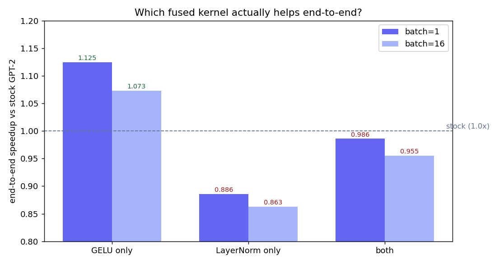

# End-to-end: patching the kernels into GPT-2

Swapped the fused LayerNorm + GELU into HuggingFace GPT-2 (`models/patch.py`) and
measured real decode throughput.

```bash
python bench/bench_end2end.py   # correctness + speed + launches/token
python bench/bench_ablation.py  # gelu-only vs ln-only vs both
```



## Correctness (both kernels patched)

| check | result |
|---|---|
| max logit diff (fp16) | 0.625 |
| top-1 token agreement | 100% |
| greedy trajectory | 128/128 tokens identical |

The patched model produces the same output as stock GPT-2.

## Speed — the honest result

Microbenchmark wins did **not** carry over naively. Ablation (tok/s vs stock):

| config | batch=1 | batch=16 |
|---|---|---|
| **GELU only** | **+12.5%** (176→198 tok/s) | **+7.3%** |
| LayerNorm only | −11% | −14% |
| both | −1.4% | −4.5% |

Also: fusing cut **kernel launches/token from 487 → 268**.

## Why

- **GELU fusion is a real win.** GPT-2 ships its GELU as ~6 separate kernels that
  PyTorch never fused, so replacing them with one kernel genuinely helps: **+12.5%
  end-to-end** at batch=1.
- **LayerNorm fusion is a net loss.** PyTorch's `native_layer_norm` is already a
  well-tuned fused kernel. Our replacement adds Python-wrapper overhead
  (`.contiguous()`, reshape, an `nn.Module` call) plus Triton launch cost that
  outweighs any benefit — so it *regresses* ~11–14%.
- Combined, the GELU gain ≈ the LayerNorm loss, so "both" looks flat.

## Takeaways

1. **Op-level microbenchmarks can mislead.** A 3.5–7× kernel win became +12.5%
   end-to-end (GELU is a small fraction of total time), and a "1.1–1.4× faster"
   LayerNorm was actually *slower* in the real model. Always measure end-to-end
   and ablate.
2. **Ship GELU-only** — a clean, correct, measured **+12.5%** at batch=1.
3. Don't re-fight battles the framework already won (LayerNorm).

## Next

The bigger lever is still the ~87% GPU idle time from profiling: CUDA graphs /
`torch.compile` to remove per-launch CPU overhead, which should also let the
remaining fused kernels shine.
