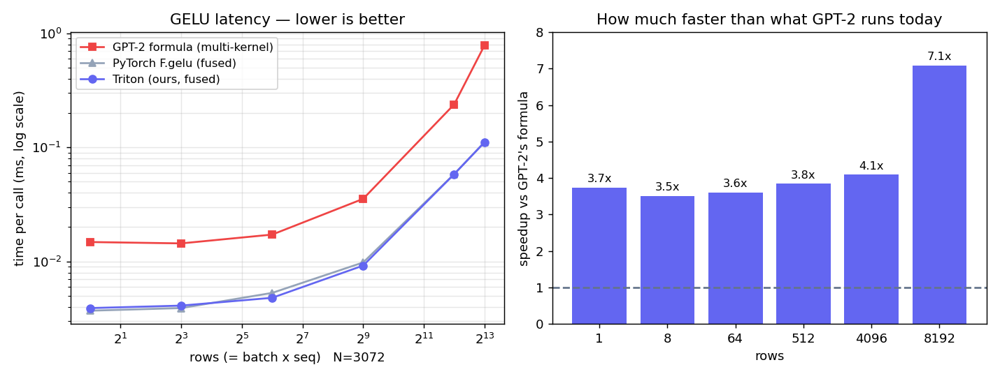

# Fused GELU (Triton)

GPT-2's tanh-approximation GELU, fused into one elementwise kernel. HuggingFace
runs the formula as ~6 separate ops (pow, mul, add, tanh, ...), each a full
read+write through HBM; this does the whole thing in one pass.

```bash
python bench/bench_gelu.py
```



## Results (RTX 4090, N=3072, fp16)

| rows × 3072 | max err | GPT-2 formula | torch F.gelu | triton | vs GPT-2 | vs torch | triton GB/s |
|---|---|---|---|---|---|---|---|
| 1 (decode) | 2e-3 | 14.8 µs | 3.7 µs | 3.9 µs | 3.7× | 0.95× | 3 |
| 8          | 2e-3 | 14.4 µs | 3.9 µs | 4.1 µs | 3.5× | 0.94× | 24 |
| 64         | 2e-3 | 17.2 µs | 5.3 µs | 4.8 µs | 3.6× | 1.11× | 165 |
| 512        | 2e-3 | 35.4 µs | 9.8 µs | 9.2 µs | 3.8× | 1.07× | 682 |
| 4096       | 2e-3 | 238 µs  | 58 µs  | 58 µs  | 4.1× | 1.00× | 864 |
| 8192       | 2e-3 | 786 µs  | 111 µs | 111 µs | 7.1× | 1.00× | 907 |

- **Correct** within fp16 tolerance.
- **3.5–7× faster** than the multi-kernel formula GPT-2 actually runs; speedup
  grows with size as memory traffic dominates (~6× less HBM traffic).
- Matches PyTorch's own fused `F.gelu(approximate='tanh')` (~1.0×) — the right
  sanity check.
- Reaches **907 GB/s ≈ 90%** of the 4090's ~1 TB/s ceiling.

## Note

Unlike LayerNorm, PyTorch does *not* fuse GPT-2's hand-written GELU — that's why
this is a real end-to-end win when patched into the model.
