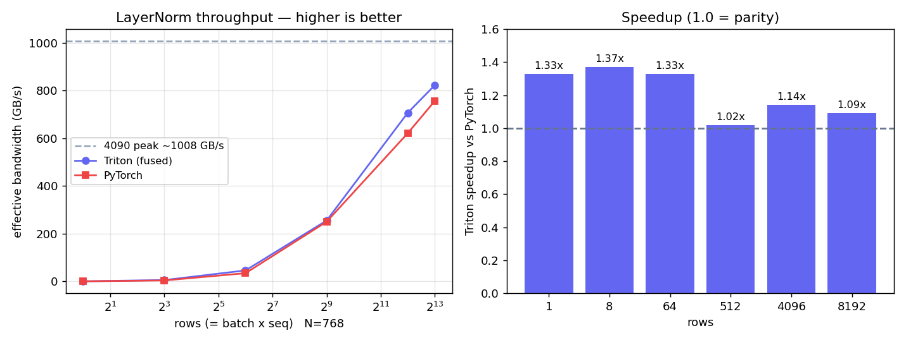

# Fused LayerNorm (Triton)

One Triton program per row: load the row into SRAM once, compute mean/variance,
normalize, apply weight/bias, write back once. Stats accumulated in fp32 for
stability (matches PyTorch). Forward / inference only.

```bash
python bench/bench_layernorm.py
```



## Results (RTX 4090, N=768, fp16)

| rows × 768 | max abs err | torch | triton | speedup | triton GB/s |
|---|---|---|---|---|---|
| 1 (decode)  | 0      | 5.5 µs  | 4.1 µs  | 1.33× | — |
| 8           | 1e-3   | 5.6 µs  | 4.1 µs  | 1.37× | 6 |
| 64          | 2e-4   | 5.6 µs  | 4.3 µs  | 1.33× | 46 |
| 512         | 2e-3   | 6.3 µs  | 6.2 µs  | 1.02× | 255 |
| 4096        | 4e-3   | 20.2 µs | 17.8 µs | 1.14× | 707 |
| 8192        | 4e-3   | 33.3 µs | 30.6 µs | 1.09× | 823 |

- **Correct** within fp16 tolerance at every size.
- **1.1–1.4× faster** than PyTorch's (already fused) `native_layer_norm`.
- At 8192 rows it reaches **823 GB/s ≈ 82% of the 4090's ~1 TB/s** ceiling —
  confirming LayerNorm is memory-bound and we're near the limit.

## Note

PyTorch's LayerNorm is already a single fused kernel, so the standalone win is
modest. The larger end-to-end gains come from fusing it **with** neighbouring ops
(residual-add + LayerNorm) and from fused GELU (which PyTorch does *not* fuse) —
those are the next steps.
